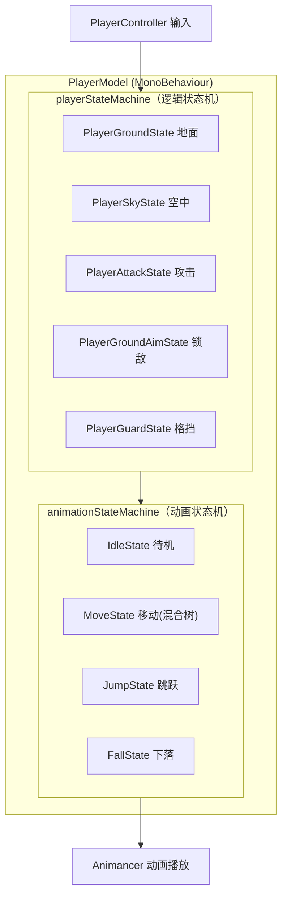
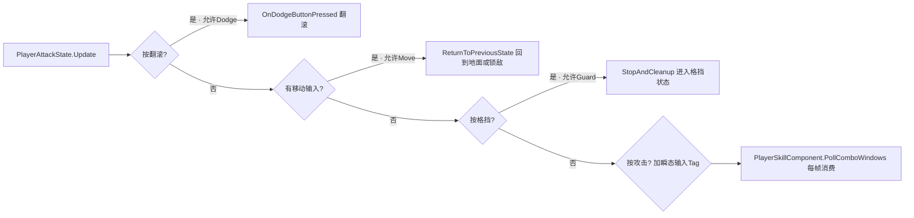
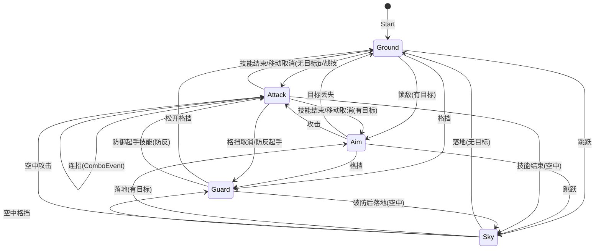

# UCCS — 玩家状态机系统技术文档

> **项目定位**：基于 Unity 6 (URP) + Animancer 的第三人称动作游戏（类魂 + 鬼泣手感），
> 核心战斗系统参考 UE5 GAS 架构。
> **本文目的**：系统化记录玩家双状态机（逻辑状态机 + 动画状态机）的设计与实现，
> 同时作为面试时"结合项目回答状态机问题"的参考手册。
> **参考格式**：本文档结构对齐《网络同步系统技术文档》的详细程度。

---

# 目录

1. [状态机架构总览](#1-状态机架构总览)
2. [通用状态机 StateMachine](#2-通用状态机-statemachine)
3. [双状态机设计（逻辑层 + 动画层）](#3-双状态机设计逻辑层--动画层)
4. [逻辑状态机详解](#4-逻辑状态机详解)
    - [4.1 PlayerGroundState 地面态](#41-playergroundstate-地面态)
    - [4.2 PlayerAttackState 攻击态](#42-playerattackstate-攻击态)
    - [4.3 PlayerSkyState 空中态](#43-playerskystate-空中态)
    - [4.4 PlayerGroundAimState 锁敌态](#44-playergroundaimstate-锁敌态)
    - [4.5 PlayerGuardState 格挡态](#45-playerguardstate-格挡态)
5. [动画状态机详解](#5-动画状态机详解)
6. [输入系统与状态路由](#6-输入系统与状态路由)
7. [状态转换完整图](#7-状态转换完整图)
8. [调用链与生命周期](#8-调用链与生命周期)
9. [踩坑记录（生产事故）](#9-踩坑记录生产事故)
10. [面试速查清单（带答案版）](#10-面试速查清单带答案版)

---

# 1. 状态机架构总览

## 1.1 双状态机设计

玩家拥有**两套独立的状态机**，分别驱动"逻辑行为"和"动画表现"：



| 维度 | 逻辑状态机 | 动画状态机 |
|------|-----------|-----------|
| 状态集 | ground / sky / attack / aim / guard | idle / move / jump / fall / aim |
| 驱动 | PlayerController 输入 + 技能事件 | 逻辑状态 + 输入 |
| 职责 | 决定"能做什么"（能否攻击/翻滚/格挡） | 决定"播什么动画" |
| 切换方式 | `playerModel.ChangePlayerState(PlayerState.xxx)` | `playerModel.ChangeAnimationState(PlayerAnimationState.xxx)` |
| 基类 | `PlayerStateBase` | `PlayerStateBase`（同一个基类！） |

> **设计亮点**：两套状态机共用同一个 `PlayerStateBase` 基类和 `StateMachine` 通用引擎，
> 只是注册的状态类不同。动画状态机甚至复用了逻辑状态的 `playerModel`/`playerController` 引用。

## 1.2 为什么拆两套状态机（面试必答）

> **"把'能做什么'和'播什么'分开，是动作游戏状态机的核心拆分。**
> 攻击态（逻辑）里不需要关心动画是 idle 还是 move；移动态（动画）里不需要知道
> 玩家是否在锁敌。逻辑状态决定规则（能不能翻滚、能不能被取消），动画状态决定表现
> （走、跑、跳的混合）。两个维度独立演进，改动画不影响玩法逻辑。"

---

# 2. 通用状态机 StateMachine

## 2.1 核心实现

```csharp
// Assets/Scripts/Base/StateMachine.cs
public class StateMachine
{
    private StateBase currentState;
    private IStateOwner owner;
    private Dictionary<Type, StateBase> states = new();   // 状态实例缓存池

    public void EnterState<T>(object parameter = null) where T : StateBase, new()
    {
        if (currentState != null && currentState.GetType() == typeof(T)) return; // 幂等：同状态不重复进入
        currentState?.Exit();
        currentState = LoadState<T>();
        currentState.Enter(parameter);
    }

    private StateBase LoadState<T>() where T : StateBase, new()
    {
        if (!states.TryGetValue(typeof(T), out var state))
        {
            state = new T();
            state.Init(owner);          // 首次创建时注入 owner
            states.Add(typeof(T), state);
        }
        return state;                   // 之后复用实例（状态类是有状态的！）
    }
}
```

### 三个关键设计

| 设计 | 说明 |
|------|------|
| **状态实例缓存** | 每个状态类只 `new` 一次，之后复用。状态字段（如 `_isDodging`）跨切换保留，靠 Enter 重置 |
| **EnterState 幂等** | 请求的状态 == 当前状态时直接 return，防止重复 Enter/Exit（尤其防连点输入导致状态抖动） |
| **Editor 转换历史** | `#if UNITY_EDITOR` 下记录最近 20 次转换（From/To/时间戳），供 `StateMachineDebuggerWindow` 实时显示 |

## 2.2 生命周期

```
Init(owner)  → 首次加载时：注入 PlayerModel/PlayerController 引用
    ↓
Enter()      → 进入：注册 Update 委托（MonoManager）
    ↓
Update()     → 每帧：由 MonoManager 统一驱动
    ↓
Exit()       → 退出：注销 Update 委托 + 清理订阅
    ↓
Destroy()    → 状态机 Stop 时：全部状态清理
```

> **状态驱动方式**：`PlayerStateBase.Enter()` 里 `MonoManager.Instance.AddUpdateAction(Update)`，
> 退出时 `RemoveUpdateAction(Update)`。MonoManager 是单例，聚合所有 Update 委托在
> 一个 MonoBehaviour 的 Update 里统一调用——避免每个状态都挂一个 Update。

```csharp
// Assets/Scripts/Base/MonoManager.cs
public class MonoManager : SingletonPatternMonoBase<MonoManager>
{
    private Action updateAction;
    public void AddUpdateAction(Action task) => updateAction += task;
    public void RemoveUpdateAction(Action task) => updateAction -= task;
    private void Update() => updateAction?.Invoke();
}
```

---

# 3. 双状态机设计（逻辑层 + 动画层）

## 3.1 PlayerModel 的装配

```csharp
// Assets/Scripts/Player/PlayerModel.cs
public class PlayerModel : MonoBehaviour, IStateOwner, Parryable.IBehaviorController,
    UCCS.IDefenseStateProvider, UCCS.IPlayerMarker
{
    private StateMachine animationStateMachine;
    private StateMachine playerStateMachine;

    public enum PlayerState { ground, sky, attack, aim, guard }
    public enum PlayerAnimationState { idle, move, jump, fall, aim }

    void Awake()
    {
        animationStateMachine = new StateMachine(this);
        playerStateMachine = new StateMachine(this);
    }

    void Start()
    {
        ChangeAnimationState(PlayerAnimationState.idle);
        ChangePlayerState(PlayerState.ground);
    }

    public void ChangePlayerState(PlayerState newState, object parameter = null)
    {
        switch (newState)
        {
            case PlayerState.ground: playerStateMachine.EnterState<PlayerGroundState>(parameter); break;
            case PlayerState.sky:    playerStateMachine.EnterState<PlayerSkyState>(parameter); break;
            case PlayerState.attack: playerStateMachine.EnterState<PlayerAttackState>(parameter); break;
            case PlayerState.aim:    playerStateMachine.EnterState<PlayerGroundAimState>(parameter); break;
            case PlayerState.guard:  playerStateMachine.EnterState<PlayerGuardState>(parameter); break;
        }
        _PlayerState = newState;
    }
}
```

### 3.2 状态转换的三层机制

```
① 输入采集层：PlayerController.Update 读输入 → 置标志位（lightAttack/dodge/defend...）
② 状态路由层：当前状态 Update 里查标志位 → 决定切换目标（能否切取决于取消规则）
③ 状态执行层：目标状态 Enter → 播技能/播动画 → 直到退出条件
```

**关键**：输入是"标志位"而非"直接命令"。玩家按攻击键只是把 `lightAttack = true` 置位，
由**当前状态**决定是否响应（地面态直接进攻击；攻击态要查 `CanBeCanceledBy` 取消窗口）。

---

# 4. 逻辑状态机详解

## 4.1 PlayerGroundState 地面态

**职责**：移动（含奔跑倾斜）、跳跃、翻滚、攻击/战技/格挡入口。

**Update 优先级（从上到下，命中即 return）**：

| 优先级 | 输入 | 动作 |
|--------|------|------|
| 1 | `isAttacking` / `isHitting` | 直接 return（不响应新输入） |
| 2 | 移动摇杆 | 平滑加减速 + 倾斜角插值 |
| 3 | jump | 起跳 → `PlayerState.sky` |
| 4 | dodge | `OnDodgeButtonPressed()` → 体力预扣 + 完美闪避检测 + 四向翻滚 |
| 5 | aim | 切换锁敌 → `PlayerState.aim` |
| 6 | lightAttack / heavyAttack / combatArt | `PlayerState.attack` + 攻击类型参数 |
| 7 | defend | `PlayerState.guard` |

**翻滚四向判定**（相机相对）：

```csharp
// PlayerGroundState.OnDodgeButtonPressed
float angle = Vector3.Angle(playerForward, desiredMoveDirection);  // 相对面朝
if (angle <= 45f)  dodgeF;        // 前
else if (angle >= 135f) dodgeB;   // 后
else { crossY = Cross(...).y; crossY > 0 ? dodgeR : dodgeL; }  // 左/右
```

> **细节**：翻滚前 `TryConsumeDodgeStamina()` 做体力预扣（同帧幂等：`_dodgeStaminaConsumedFrame` 记录帧号，一帧内多次调用只扣一次），防止状态机与 PlayerController 双路径重复扣体力。

## 4.2 PlayerAttackState 攻击态

**职责**：攻击技能播放 + 连招 + 取消出口管理。

### 进入

```csharp
public override void Enter(object parameter = null)
{
    _currentAttackType = (AttackType)parameter;   // light / heavy / skill / skyLight / defend
    if (!playerModel.isComboChain) playerModel.isAttacking = true;
    SkillTimelineAsset startingSkill = GetStartingSkill(_currentAttackType);
    playerModel.pac.PlaySkill(startingSkill);      // PlayerSkillComponent 播放技能时间轴
    playerModel.pac.OnSkillEnd += OnSkillEnd;
}
```

### 攻击中的可取消出口（每帧 Update 检查）



**取消窗口由技能时间轴控制**：技能资产里配置 `CancelEvent`（`CancelActionType` 枚举：
Move/Dodge/Guard/Jump...），`PlayerSkillComponent.CanBeCanceledBy()` 检查当前是否处于
允许取消的帧区间。**这是"动作游戏手感"的核心**——前摇不能取消，后摇可取消。

### 连招机制（Tag 驱动）

```csharp
// PlayerAttackState.Update
if (playerController.lightAttack)
    playerModel.tagComponent.AddTransientTag(playerModel.LightAttackInputTag);  // 瞬态输入标签

// PlayerSkillComponent.PollComboWindows（每帧）
bool tagMatched = tagComponent.ConsumeTag(combo.RequiredTag);  // 消费输入 Tag
if (tagMatched && combo.nextSkill != null) PlaySkill(combo.nextSkill);  // 连招
```

输入被转成**瞬态标签**（单帧有效），技能时间轴的 `ComboEvent` 在窗口帧内轮询消费——
连招不再依赖"恰好按在某一帧"，而是"窗口内任意帧有效"（P7 修复）。

### 空中追击跳（P13）

连招目标为空中技能且玩家在地面时：`StartChaseJump` = 垂直起跳 + 水平向锁敌目标冲锋，
保证贴近被浮空的敌人（`ChaseRoutine` 协程，接近 1.2m 自动停冲）。

## 4.3 PlayerSkyState 空中态

**职责**：空中控制（重力由 OnAnimatorMove 积分）、空中攻击、空中格挡。

```csharp
public override void Update()
{
    // 落地判定：垂直速度 < 0 且着地 → 地面（有锁敌 → aim）
    if (verticalVelocity < 0 && playerController.isGround)
        playerModel.ChangePlayerState(playerModel.ts.HasTarget ? PlayerState.aim : PlayerState.ground);

    // 锁敌时：空中朝向目标 + 恢复水平移动速度（BUG6 修复）
    if (ts.HasTarget) { 朝向插值; playerController.speed = walkSpeed * movement.magnitude; }

    if (playerController.lightAttack) ChangePlayerState(attack, AttackType.skyLight);  // 空中攻击
    if (playerController.defend)      ChangePlayerState(attack, AttackType.defend);   // 空中格挡/弹反
}
```

> **踩坑（BUG6）**：锁敌时进入空中，`PlayerGroundAimState.Exit()` 会把 speed 归零，
> 导致空中无法水平移动。修复：SkyState 在锁敌时重新设置 speed。

## 4.4 PlayerGroundAimState 锁敌态

**职责**：锁敌模式（面向目标 + 环绕移动 + 翻滚恢复朝向）。

| 特性 | 说明 |
|------|------|
| 进入 | `ts.HasTarget` 时自动进入（地面态/攻击结束/落地均会检查） |
| 旋转 | 面向目标 `Quaternion.Slerp(..., 10f)` |
| 翻滚后恢复 | 翻滚越过敌人导致角度 >90° → `SmoothRotateToTarget` 协程平滑旋转（0.35s），避免相机跳变 |
| 退出 | 目标丢失 → 回 ground；攻击/翻滚/格挡 → 对应状态 |

## 4.5 PlayerGuardState 格挡态

**职责**：防御姿态（格挡/弹反/Just Guard 三合一），详见战斗文档 06。

| 机制 | 窗口 | 效果 |
|------|------|------|
| Just Guard | 进入格挡后 0.13s | 无伤 + 零消耗 + 弹开攻击者 + 慢动作 + 反击 |
| 完美弹反 | 0.18s | 中断攻击者 + 弹反硬直 |
| 普通弹反 | 0.35s | 中断攻击者 |
| 格挡 | 持续按住 | 减伤 80% + 韧性/体力消耗 + 破防 |

**关键维护**：Update 里**每帧强制攻击层权重 = 1**（`_attackLayer.SetWeight(1f)`），
对抗外部系统（HitStop/HitReaction）降权——保证防御姿态不被覆盖。

---

# 5. 动画状态机详解

动画状态机是**另一组 PlayerStateBase 子类**，只负责播动画：

| 状态 | 动画实现 | 切换条件 |
|------|---------|---------|
| IdleState | `animancer.Play(idle, 0.25f)` | 移动输入≠0 → move；跳跃 → jump；离地 → fall |
| MoveState | **LinearMixer 四段混合**：idle(0) / walk(0.7) / jog(1) / run(2) | 速度驱动 `_moveMixer.Parameter` |
| JumpState | 跳跃动画 | 落地 → idle |
| FallState | 下落动画 | 落地 → idle |

**MoveState 混合树**（Animancer LinearMixerState）：

```csharp
_moveMixer = new LinearMixerState()
{
    { _IdleAnimation, 0f },
    { _WalkAnimation, 0.7f },
    { _JogAnimation,  1f },
    { _RunAnimation,  2f }
};
// Update 里：_targetBlend 由 speed 决定，_animBlend 用 smoothSpeed=5 平滑逼近
```

> **说明**：攻击动画不走动画状态机——由 `PlayerSkillComponent` 在 **Layer 1（攻击层）**
> 单独播放，实现"攻击动画覆盖移动动画"的多层混合（见技能时间轴文档 03）。

---

# 6. 输入系统与状态路由

## 6.1 输入采集（PlayerController）

```csharp
// Update 里每帧采集 + LateUpdate 里清零（一帧有效的标志位）
movement = input.Simple.Move.ReadValue<Vector2>();
jump     = input.Simple.Jump.WasCompletedThisFrame();
defend   = input.Simple.Parry.WasPressedThisFrame();
defendHeld = input.Simple.Parry.IsPressed();
aim      = input.Simple.Aim.WasPressedThisFrame();
// 长短按区分（InputActionWatcher）：
dodgeRunWatcher.onShortPress.AddListener(() => dodge = true);        // 短按 = 翻滚
dodgeRunWatcher.onLongPressStart.AddListener(() => running = true);  // 长按 = 奔跑
attackWatcher.onShortPress.AddListener(() => lightAttack = true);    // 短按 = 轻击
attackWatcher.onLongPressStart.AddListener(() => heavyAttack = true);// 长按 = 重击
```

## 6.2 输入生命周期（一帧）

```
PlayerController.Update  → 采集输入置标志位
      ↓
当前状态.Update（MonoManager 驱动）→ 读标志位 → 决定状态切换
      ↓
PlayerController.LateUpdate → 清零标志位（dodge/combatArt/lightAttack/heavyAttack/defend）
```

> **为什么 LateUpdate 清零**：状态机 Update 由 MonoManager 在 PlayerController.Update
> 之后调用，先采集后消费再清零，保证一帧内输入恰好被消费一次，且不跨帧残留。

---

# 7. 状态转换完整图



---

# 8. 调用链与生命周期

## 8.1 一次完整攻击的调用链

```
玩家按攻击键（短按）
  → PlayerController.Update: lightAttack = true
  → PlayerGroundState.Update: 读到 lightAttack → ChangePlayerState(attack, AttackType.light)
  → PlayerModel.ChangePlayerState → playerStateMachine.EnterState<PlayerAttackState>(light)
  → PlayerAttackState.Enter:
      ├→ PlayerGroundState.Exit: 注销 Update 委托
      ├→ PlayerAttackState.Enter: 注册 Update 委托
      ├→ pac.PlaySkill(lightStart): PlayerSkillComponent 加载技能时间轴
      │     ├→ 攻击层播放动画（Animancer Layer 1）
      │     ├→ 注册帧事件（HitBox/Attack/Combo/Cancel...）
      │     └→ 激活 ClashDetector（拼刀检测）
      └→ 订阅 pac.OnSkillEnd
  → PlayerAttackState.Update（每帧）:
      ├→ 检查取消出口（翻滚/移动/格挡）
      ├→ 面向锁敌目标
      └→ 攻击输入 → 加瞬态 Tag（连招候选）
  → 技能帧事件触发:
      ├→ HitBoxEvent: 开启/关闭受击盒
      ├→ AttackEvent: 形状 Overlap 判定 → 命中 → 拼刀检测/伤害
      └→ ComboEvent: 连招窗口轮询输入
  → 动画结束 → pac.HandleAnimationEnd → StopAndCleanup → OnSkillEnd
  → PlayerAttackState.OnSkillEnd: ReturnToPreviousState（有锁敌→aim，否则→ground/sky）
```

## 8.2 StateMachineDebuggerWindow

Editor 工具（`Assets/Editor/StateMachineDebuggerWindow.cs`，445 行）：
- 实时显示当前状态类型 + 已注册状态列表
- 最近 20 次转换历史（From → To + 时间戳）
- 依赖 `StateMachine` 的 `#if UNITY_EDITOR` 记录机制

---

# 9. 踩坑记录（生产事故）

| # | 问题 | 根因 | 修复 |
|---|------|------|------|
| P1 | 翻滚被连点多次触发 | EnterState 未做幂等 | EnterState 同类型直接 return |
| P2 | 翻滚重复扣体力 | PlayerController 和状态机双路径扣体力 | `_dodgeStaminaConsumedFrame` 同帧幂等标记 |
| P3 | 连招窗口太窄几乎按不出 | ComboEvent 只在起始帧判一次（16ms 窗口） | 改为窗口 [StartFrame,EndFrame] 内每帧轮询（P7） |
| P4 | 打断攻击重播卡在被打断位置 | Animancer FromStart 复用零权重状态不重置时间 | `animState.TimeD = 0` 显式归零 |
| P5 | 受击时"边挥刀边挨打" | 攻击层 0.25s 淡出期间与受击层混权 | `ForceSuppressAttackLayer` 立即清零攻击层权重（P9） |
| P6 | 锁敌空中无法水平移动 | AimState.Exit 归零 speed | SkyState 锁敌时重设 speed |
| P7 | 攻击层被外部系统降权导致防御姿态丢失 | HitStop/HitReaction 干扰攻击层 | GuardState 每帧强制 `SetWeight(1f)` |
| P8 | 翻滚越过后旋转生硬跳变 | Update 硬拉旋转 | 大角度用协程平滑旋转过渡 |

---

# 10. 面试速查清单（带答案版）

**Q1：为什么用两套状态机而不是一套？**
> 逻辑（能做什么）和表现（播什么）分离。攻击态关心取消窗口和连招，不关心走跑混合；
> 移动动画态只关心速度混合，不关心战斗规则。独立演进、各自简单。

**Q2：状态是怎么驱动的？每帧的流程？**
> 输入采集（PlayerController.Update 置标志位）→ 状态 Update（MonoManager 聚合委托调用，
> 当前状态查标志位决定是否切换）→ LateUpdate 清零标志位。状态自身通过 Enter/Exit
> 向 MonoManager 注册/注销 Update 委托，保证"只有一个状态在跑"。

**Q3：攻击取消怎么做？**
> 技能时间轴配置 CancelEvent 定义取消窗口（前摇不可取消、后摇可取消）。
> 攻击态每帧查 `pac.CanBeCanceledBy(CancelActionType)`，允许则翻滚/移动/格挡打断。

**Q4：连招怎么实现？**
> 输入转瞬态标签（TagComponent.AddTransientTag），技能时间轴 ComboEvent 在
> [StartFrame, EndFrame] 窗口内每帧轮询 `ConsumeTag`，命中则播下一段技能。
> 窗口制判定，不是单帧判定。

**Q5：状态切换的幂等性怎么保证？**
> EnterState 里 `if (currentState.GetType() == typeof(T)) return`。防止同状态重复
> Enter/Exit 导致抖动（比如连点攻击键）。

**Q6：怎么调试状态机？**
> StateMachine 在 Editor 下记录最近 20 次转换历史（From/To/时间戳），
> StateMachineDebuggerWindow 实时显示当前状态和转换记录。

---

*下一篇：[GAS 深度剖析](09-GAS-Deep-Dive.md) · [敌人行为树](10-Enemy-BT.md)*
