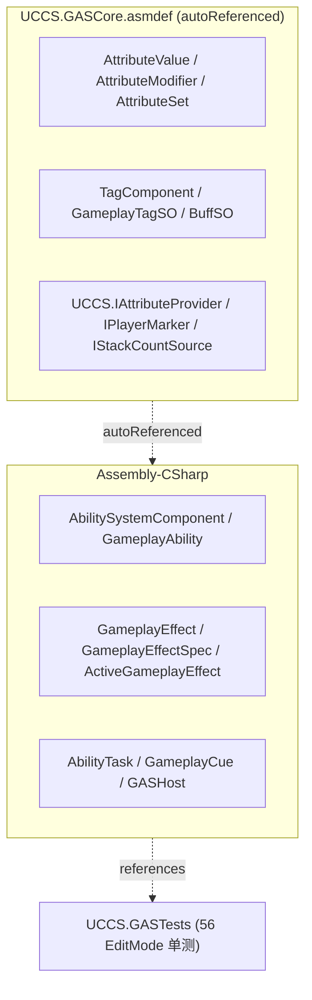
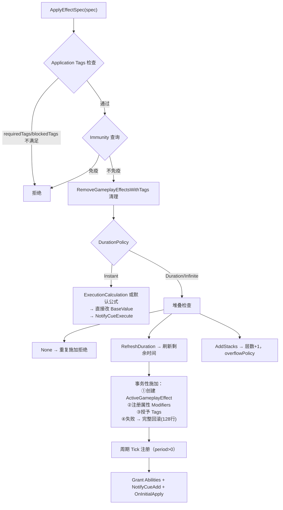
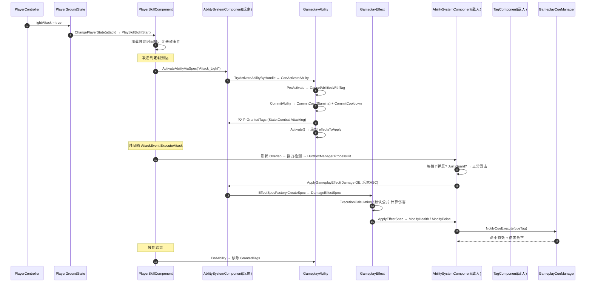

# UCCS — GAS (Gameplay Ability System) 深度剖析

> **项目定位**：基于 Unity 6 (URP) 的动作游戏，战斗系统深度参考 **UE5 GAS** 架构实现。
> **本文目的**：GAS 的**面试级**深度剖析——不仅讲有什么，更讲完整调用链、生命周期时序、
> 设计取舍与踩坑，可对照代码逐行阅读。
> **阅读前提**：本文是《01-GAS-System.md》的超集，01 讲"有什么"，本文讲"怎么运转"。

---

# 目录

1. [GAS 全景与 UE5 映射](#1-gas-全景与-ue5-映射)
2. [程序集结构（UCCS.GASCore）](#2-程序集结构uccsgascore)
3. [AbilitySystemComponent 核心调度](#3-abilitysystemcomponent-核心调度)
4. [Ability 生命周期完整时序](#4-ability-生命周期完整时序)
5. [属性系统：聚合公式与 Aggregator](#5-属性系统聚合公式与-aggregator)
6. [效果系统：施加/堆叠/事务性回滚](#6-效果系统施加堆叠事务性回滚)
7. [标签系统：引用计数与瞬态标签](#7-标签系统引用计数与瞬态标签)
8. [冷却系统三种模式](#8-冷却系统三种模式)
9. [AbilityTask 异步任务](#9-abilitytask-异步任务)
10. [GameplayCue 反馈系统](#10-gameplaycue-反馈系统)
11. [一次攻击的 GAS 全流程（时序图）](#11-一次攻击的-gas-全流程时序图)
12. [设计取舍与踩坑](#12-设计取舍与踩坑)
13. [面试速查清单（带答案版）](#13-面试速查清单带答案版)

---

# 1. GAS 全景与 UE5 映射

## 1.1 UE5 → UCCS 同构映射（面试基础题）

| UE5 GAS | UCCS 实现 | 文件 |
|---------|----------|------|
| `UAbilitySystemComponent` | `AbilitySystemComponent` | `GASSystem/AbilitySystemComponent.cs` (1284行) |
| `UGameplayAbility` | `GameplayAbility` | `GASSystem/GameplayAbility.cs` (551行) |
| `FGameplayAbilitySpec` | `GameplayAbilitySpec` | `GASSystem/Core/GameplayAbilitySpec.cs` |
| `UGameplayEffect` | `GameplayEffect` (SO) | `ScriptsObject/GameplayEffect.cs` |
| `FGameplayEffectSpec` | `GameplayEffectSpec` | `GASSystem/GameplayEffectSpec.cs` |
| `FActiveGameplayEffect` | `ActiveGameplayEffect` | `GASSystem/ActiveGameplayEffect.cs` |
| `UAttributeSet` | `AttributeSet` | `GASCore/AttributeSet.cs` |
| `FGameplayAttribute` | `GameplayAttribute` (枚举) | `GASCore/AttributeModifier.cs` |
| `FGameplayTag` | `GameplayTagSO` (SO) | `GASCore/GameplayTagSO.cs` |
| `UAbilityTask` | `AbilityTask` | `GASSystem/Task/AbilityTask.cs` |
| `UGameplayCueManager` | `GameplayCueManager` | `GASSystem/GameplayCueManager.cs` |
| `FGameplayEventData` | `GameplayEventData` | `GASSystem/Core/GameplayEventData.cs` |
| `FGameplayTagQuery` | `GameplayTagQuery` | `GASSystem/Core/GameplayEventData.cs` |
| `UAttributeSet` 修改器 | `AttributeModifier` / `EffectAttributeModifier` | `GASCore/AttributeModifier.cs` |

## 1.2 核心设计理念

```
① 数据驱动：能力/效果/标签全部 ScriptableObject，策划可配，代码零改动
② 标签驱动通信：Ability 激活/阻塞、GE 施加条件/免疫、连招、Cue 全部走 GameplayTag
③ 解耦攻击方/受击方：攻击命中只施加 Tag/Effect，受击方自己响应
```

---

# 2. 程序集结构（UCCS.GASCore）

GAS 核心纯逻辑被抽到独立 asmdef（**Unity 6 中 asmdef 无法引用 Assembly-CSharp**，
被测代码必须独立程序集，详见 `GAS_Tests_README.md`）：



---

# 3. AbilitySystemComponent 核心调度

## 3.1 职责矩阵

| 子系统 | 入口方法 | 说明 |
|--------|---------|------|
| Ability 管理 | `GiveAbility` / `TryActivateAbilityByHandle` / `TryActivateAbilitiesByTag` / `CancelAbility` | Spec 列表管理 |
| Effect 管理 | `ApplyEffectSpec` / `RemoveActiveEffectByHandle` / `TickFromHost` | 活跃效果生命周期 |
| Tag 管理 | `AddLooseGameplayTag` / `GetTagCount` / `RegisterGameplayTagEvent` | 转发 TagComponent |
| Context | `MakeEffectContext` / `MakeOutgoingSpec` | 效果上下文与出站 Spec |
| Event | `HandleGameplayEvent` | 触发匹配 Ability |
| Task | `RegisterTask` / `CancelTasksForAbility` / `TickActiveTasks` | 能力任务池 |

## 3.2 双 API 兼容（历史演进）

```csharp
// 旧版 string-key API（向后兼容）
public int ActivateAbility(string abilityName) { ... }

// 新版 Spec API（推荐，对齐 UE5）
public int GiveAbility(GameplayAbility ability, int level = 1, int inputID = -1) { ... }
public bool TryActivateAbilityByHandle(int handle) { ... }
```

> `PlayerSkillComponent.ActivateAbilityViaSpec` 先按 Spec API 查找，找不到再 fallback
> 旧 string-key——新代码一律走 Spec API（收敛计划见 `07-System-Consolidation-Plan.md`）。

## 3.3 GASHost 全局调度

```csharp
// GASSystem/Core/GASHost.cs
public class GASHost : MonoBehaviour
{
    public float TimeScale { get; set; } = 1f;   // 全局时间缩放（慢动作/暂停）
    private List<AbilitySystemComponent> _registeredASCs;

    void Update()
    {
        float dt = DeltaTime;                      // Time.deltaTime * TimeScale
        for (int i = _registeredASCs.Count - 1; i >= 0; i--)
            _registeredASCs[i].TickFromHost(dt);   // 集中驱动所有 ASC
    }
}
```

> **设计点**：所有 ASC 由 GASHost **集中 Tick**（不是各自 Update），这样全局
> TimeScale（子弹时间/暂停）能统一作用到所有活跃效果的周期 Tick。

---

# 4. Ability 生命周期完整时序

## 4.1 生命周期方法链（对齐 UE5）

```
GiveAbility → 创建 GameplayAbilitySpec → 加入 _activatableAbilities
   ↓
TryActivateAbilityByHandle(handle)
   ├→ 检查 BlockAbilitiesWithTag（被其他活跃能力阻塞？）
   ├→ CanActivateAbility（冷却？消耗？标签？）
   ├→ 按 InstancingPolicy 决定实例策略
   ├→ PreActivate
   ├→ CancelAbilitiesWithTag（取消冲突能力）
   ├→ 授予 ActivationOwnedTags
   ├→ ActivateAbility
   │    ├→ CommitAbility → CommitCost + CommitCooldown
   │    ├→ 授予 GrantedTags
   │    └→ Activate()（子类实现）
   └→ OnAbilityActivated 事件
   ↓
EndAbility → 移除 GrantedTags + ActivationOwnedTags → 移除 cancelOnAbilityEnd 关联 GE
```

## 4.2 核心代码（GameplayAbility）

```csharp
// GASSystem/GameplayAbility.cs
public abstract class GameplayAbility
{
    // 实例化策略：每个 Actor 一份 / 每次激活一份 / 不实例化
    public InstancingPolicy AbilityInstancingPolicy;

    // 标签集合
    public List<GameplayTagSO> AbilityTags;            // 自身标签
    public List<GameplayTagSO> CancelAbilitiesWithTag; // 激活时取消
    public List<GameplayTagSO> BlockAbilitiesWithTag;  // 激活时阻塞
    public List<GameplayTagSO> ActivationOwnedTags;    // 激活时授予

    // 冷却三模式
    public float Cooldown;                  // 简单时间戳
    protected GameplayEffect _cooldownEffect; // 标签驱动（GE）
    public int MaxCharges;                  // 充能式

    public virtual bool CanActivateAbility(...)   // 预检查（无副作用）
    public virtual void PreActivate(...)          // 预激活钩子
    public virtual void ActivateAbility(...)      // 实际激活
    public virtual bool CommitAbility(...)        // 提交消耗+冷却（原子）
    public virtual void EndAbility(...)           // 结束
    public virtual bool ShouldAbilityRespondToEvent(...) // 事件响应
}
```

## 4.3 提交的原子性（踩坑 P5）

```csharp
// CommitAbility：先检查再提交，任一失败则整体失败（防止"扣了费没上冷却/上了冷却没扣费"）
public bool CommitAbility(AbilitySystemComponent asc, ...)
{
    if (!CheckCost(asc)) return false;
    if (!CheckCooldown(asc)) return false;
    CommitCost(asc);
    CommitCooldown(asc);
    return true;
}
```

> 早期实现是"先扣费后上冷却"，中途失败会导致状态不一致（e5ba05b6 提交修复）。

---

# 5. 属性系统：聚合公式与 Aggregator

## 5.1 聚合公式

```
CurrentValue = (BaseValue + Σ Additive × StackCount) × (1 + Σ Multiplicative × StackCount)
               → Override 取最后一个
               → OnPreAttributeChange 钳制
               → CurrentValue
```

## 5.2 AggregatorMode（UE5 AggregatorEvaluateParameters 对应）

| 模式 | 行为 | 应用场景 |
|------|------|---------|
| `Default` | Base + ΣAdd × (1+ΣMult)，Override 取最后 | 通用属性 |
| `MostPositive` | 只取最大正向 Additive modifier | 增益取最大（如"最强 buff 生效"） |
| `MostNegative` | 只取最大负向 Additive modifier | 减益取最大（如"最强 debuff 生效"） |

## 5.3 StackCount 感知

```csharp
// AttributeValue.GetCurrentValue 内部
if (mod.Source != null)               // IStackCountSource（解耦接口）
    return mod.value * mod.Source.CurrentStacks;   // 有效值 = value × 层数

// 堆叠层数变化 → SetDirty() → 下次查询重算（按需缓存）
```

> **解耦设计**：`AttributeModifier.Source` 是 `UCCS.IStackCountSource` 接口
> （`ActiveGameplayEffect` 实现）。测试用轻量假实现，不依赖重组件（GASCore 程序集解耦）。

## 5.4 属性修改器 Magnitude 计算（4 种）

| 模式 | 说明 |
|------|------|
| `Static` | SO 上的固定值 |
| `AttributeBased` | 施加者/目标快照指定属性（`CapturedAttackerAttributes`） |
| `Custom` | `IMagnitudeCalculation` 接口自定义 |
| `SetByCaller` | 调用方运行时通过 Tag 指定值（`SetByCallerMagnitude`） |

> **应用**：Just Guard 反击伤害 = `SetMagnitudeOverride(i, GetMagnitude(i) × 1.5)`，
> 无需改任何 GE 资产（见 `06-Just-Guard-Clash-System.md`）。

---

# 6. 效果系统：施加/堆叠/事务性回滚

## 6.1 效果类型（EffectSpecFactory 工厂）

| EffectType | Spec 子类 | 用途 |
|-----------|----------|------|
| Damage | `DamageEffectSpec` | 伤害（ExecutionCalculation 或默认公式） |
| Heal | `HealEffectSpec` | 治疗 |
| Buff | `BuffEffectSpec` | 属性修改器管理 |
| Cost | `CostEffectSpec` | 消耗检查+扣除 |
| Cooldown | `GameplayEffectSpec`(基类) | CD 标签管理 |
| Custom | `GameplayEffectSpec` | 默认基类行为 |

## 6.2 施加完整流程（事务性）



## 6.3 事务性回滚（面试亮点）

```csharp
// 记录所有已应用的 modifiers 和 tags，失败时遍历回滚
foreach (var (attrVal, modifier) in appliedModifiers)
    attrVal.RemoveModifier(modifier);
foreach (var tag in appliedTags)
    tagComponent.RemoveTag(tag);
```

> **为什么重要**：一个 Duration 效果要同时做三件事（建实例/注册修改器/授予标签），
> 任一步失败（如属性不存在）若不回滚，会产生"标签有了但修改器没有"的脏状态，
> 导致角色属性永久错乱。事务性保证"要么全部生效，要么全部不生效"（f62e43e3 提交）。

## 6.4 堆叠策略（对齐 UE5）

| 策略 | 行为 |
|------|------|
| `None` | 不可叠加，重复施加被拒绝 |
| `RefreshDuration` | 刷新剩余时间（Reset/Extend 子策略） |
| `AddStacks` | 层数+1，达上限触发 overflowPolicy（拒绝新效果 / 触发 overflowEffect） |
| Expiration | RemoveAllStacks / RemoveOneStack |

---

# 7. 标签系统：引用计数与瞬态标签

## 7.1 三种标签类型（TagComponent）

| 类型 | 生命周期 | 用途 |
|------|---------|------|
| **永久标签**（RefCount） | GE 授予/移除 | 状态标签（State.Guarding、破防） |
| **瞬态标签**（Transient） | 单帧有效 | 连招输入（LightAttackInput）、弹反事件 |
| **缓存标签**（Cached） | 0.25s | 瞬态标签的历史（宽限判定） |

## 7.2 核心方法

```csharp
AddTag(tag)        // 引用计数 +1
RemoveTag(tag)     // 引用计数 -1（归零才真正移除）
HasTag(tag)        // 精确匹配（含瞬态）
HasTagOrChild(tag) // 层级匹配（父标签命中子标签）
ConsumeTag(tag)    // 消耗性查询（连招触发，一次性）
AddTransientTag(tag) // 单帧标签
```

## 7.3 层级匹配

```csharp
// GameplayTagSO.HasChild：沿 otherTag.parentTag 链向上找 this
public bool HasChild(GameplayTagSO otherTag)
{
    var current = otherTag.parentTag;
    while (current != null)
    {
        if (current == this) return true;
        current = current.parentTag;
    }
    return false;
}
```

> **语义注意**：无循环引用时 `HasChild(自身)` 返回 **false**（沿链向上找不到自己），
> `HasChild(子标签)` 返回 true。测试按此断言（`HasChild_Self_ReturnsFalseWithoutCycle`）。

---

# 8. 冷却系统三种模式

| 模式 | 实现 | 优先级 |
|------|------|--------|
| 简单时间戳 | `Time.time < lastCastTime + Cooldown` | 最低 |
| 标签驱动 | 施加 Duration CooldownEffect + 授予 cooldownTag，`IsOnCooldown()` 查 Tag | 中 |
| 充能式 | `MaxCharges > 1`，ChargeRecoveryTime 恢复 | 最高 |

**标签驱动 CD 的精妙**（面试可讲）：
```
CommitCooldown → 创建 CooldownEffectSpec → 施加 Duration GE + 授予 cooldownTag
→ IsOnCooldown() 检查 TagComponent.HasTag(cooldownTag)
→ GE 到期自动移除 tag → CD 结束
```
CD 完全融入 GE 生命周期 → 天然支持 Immunity / RemoveEffectsWithTags 等高级交互。

---

# 9. AbilityTask 异步任务

## 9.1 架构

```csharp
public abstract class AbilityTask
{
    public bool IsActive { get; }
    public bool IsFinished { get; }
    public EAbilityTaskWaitState WaitState;  // WaitingOnGame / WaitingOnUser / WaitingOnAvatar
    public event Action OnTaskCompleted;
    public event Action OnTaskCancelled;
}
```

## 9.2 已实现任务

| 任务 | 等待什么 |
|------|---------|
| `WaitDelayTask` | 指定时间 |
| `WaitInputTasks` | 玩家输入 |
| `WaitTargetDataTask` | 目标数据 |
| `WaitGameplayEventTask` | GameplayEvent |
| `WaitAttributeChangeTask` | 属性变化 |
| `WaitGameplayTagTask` | 标签变化 |
| `WaitOverlapTask` | 碰撞重叠 |
| `SearchTargetTask` | 搜索目标 |
| `PlayMontageAndWaitTask` | 动画播放完成 |
| `EndAbilityTask` | 结束能力 |
| `RemainingAbilityTasks` | 剩余任务全部完成 |

> **当前定位**：时间轴事件（EventFactory）负责"技能动画帧事件"，AbilityTask 负责
> "能力异步等待"，职责已分离（见 `07-System-Consolidation-Plan.md` 第 4 条）。

---

# 10. GameplayCue 反馈系统

## 10.1 架构

```
GameplayCueManager (单例)
  └─ Dictionary<GameplayTagSO, IGameplayCue>
       ├─ ParticleCue   粒子特效
       ├─ SoundCue      音效
       ├─ FloatingTextCue 浮动伤害数字
       └─ HitImpactCue  受击特效（可扩展任意实现）
```

## 10.2 接口与触发时机

```csharp
public interface IGameplayCue
{
    void OnExecute(GameObject target, GameplayEffectSpec spec);  // Instant 效果
    void OnAdd(GameObject target, GameplayEffectSpec spec);      // Duration 施加
    void OnRemove(GameObject target);                             // Duration 移除
}
```

| 时机 | 触发 |
|------|------|
| Instant GE 施加 | `ExecuteCue(tag)` → `cue.OnExecute()` |
| Duration GE 施加 | `AddCue(tag)` → `cue.OnAdd()` |
| Duration GE 移除 | `RemoveCue(tag)` → `cue.OnRemove()` |

> **设计**：效果数据里配 `cueTag`，特效系统完全解耦——攻击方只管施放效果，
> 视觉/音效由 CueManager 按标签分发。

---

# 11. 一次攻击的 GAS 全流程（时序图）

> 玩家释放一次攻击技能，从输入到伤害结算的 GAS 视角完整时序：



---

# 12. 设计取舍与踩坑

## 12.1 设计取舍

| 决策 | 为什么 |
|------|--------|
| GameplayTag 用 SO 而非字符串 | 层级匹配 + Inspector 可视化 + 资产复用 |
| 标签驱动而非直接伤害调用 | 攻击方/受击方完全解耦，可插拔 |
| GASCore 独立程序集 | Unity 6 asmdef 无法引用 Assembly-CSharp（实测） |
| AttributeModifier.Source 用接口 | 解耦 ActiveGameplayEffect，纯逻辑可单测 |
| 旧 string-key API 保留 | 场景资产/旧代码兼容，收敛计划中逐步淘汰 |

## 12.2 踩坑记录

| 提交 | 问题 | 修复 |
|------|------|------|
| e5ba05b6 | Commit 非原子（先扣费后上冷却） | CommitAbility 先检查后提交 |
| f62e43e3 | Duration 施加部分失败留脏状态 | 事务性施加 + 完整回滚 |
| ff176b3d | 缺失属性时 Apply 失败无感知 | 视作 apply failure + 测试反射修复 |
| facd05a2 | HasTagOrChild 迭代错误集合 | 改用 _tagRefCounts 迭代 |
| 598e0fdf | 值类型 AttributeModifier 无效 null 检查 | 移除 |
| 6071e346 | 格挡无攻击者反制 | 格挡命中给攻击者施加 staggerEffect |

---

# 13. 面试速查清单（带答案版）

**Q1：GAS 相比直接写伤害逻辑有什么优势？**
> 三层解耦：能力（能不能放）、效果（放了发生什么）、属性（数值怎么算）各自独立，
> 全部数据驱动。标签体系让攻击方不用知道受击方怎么响应——攻击命中只施加
> Effect 和 Tag，格挡/弹反/免疫都是受击方自己的标签响应。

**Q2：效果施加的原子性怎么保证？**
> Duration/Infinite 效果施加是"事务"：创建实例、注册修改器、授予标签三步，
> 任一步失败遍历回滚已应用的部分，保证不留脏状态。

**Q3：属性怎么做到按需重算？**
> AttributeValue 用 Dirty 标记：BaseValue 或 modifier 变化时置 dirty，下次
> GetCurrentValue 才重算并缓存。StackCount 变化（外部）需显式 SetDirty。

**Q4：冷却有几种？怎么选？**
> 三种：简单时间戳（最省）、标签驱动 GE（最灵活，融入效果生命周期）、充能式
> （多段技能）。优先级 充能 > 标签 > 时间戳。

**Q5：怎么解耦攻击方和受击方？**
> 攻击方武器命中 → HurtBoxManager.ProcessHit → 按受击方标签分流（Just Guard/
> 弹反/格挡/闪避/受击），受击方 ASC 自己 ApplyEffect。攻击方不直接改受击方血量。

**Q6：单测覆盖了什么？**
> 56 个 EditMode 测试：AttributeValue 聚合公式/StackCount/Dirty/钳制、TagComponent
> 引用计数/ConsumeTag/层级匹配、AttributeSet 事件/消耗（见 GAS_Tests_README.md）。

---

*上一篇：[玩家状态机](08-Player-State-Machine.md) · 下一篇：[敌人行为树](10-Enemy-BT.md)*
