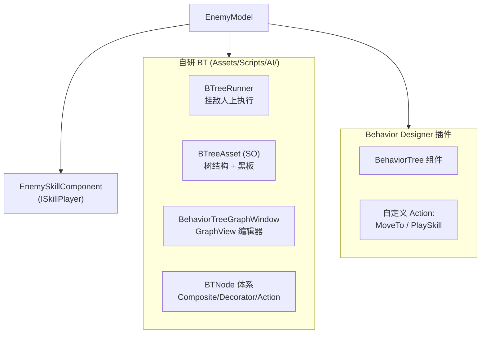
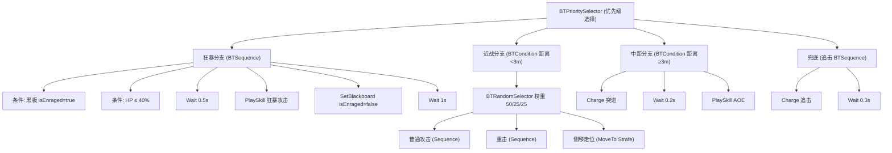
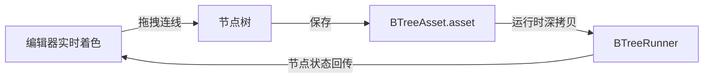

# UCCS — 敌人 AI 行为树技术文档

> **项目定位**：基于 Unity 6 (URP) 的动作游戏（类魂 + 鬼泣手感），敌人 AI 使用行为树。
> **本文目的**：系统化记录敌人 AI 的双轨行为树方案——自研 BT 引擎（运行时 + 可视化编辑器）
> 与 Behavior Designer 插件的共存现状、节点实现、执行流程与扩展方法。
> **参考格式**：本文档结构对齐《网络同步系统技术文档》的详细程度。

---

# 目录

1. [AI 双轨架构总览](#1-ai-双轨架构总览)
2. [自研 BT 核心引擎](#2-自研-bt-核心引擎)
    - [2.1 节点类型体系](#21-节点类型体系)
    - [2.2 节点三态与执行语义](#22-节点三态与执行语义)
    - [2.3 组合节点实现](#23-组合节点实现)
3. [资产与序列化（SerializeReference）](#3-资产与序列化serializereference)
4. [黑板 Blackboard](#4-黑板-blackboard)
5. [叶子节点 Actions 详解](#5-叶子节点-actions-详解)
6. [执行引擎 BTreeRunner](#6-执行引擎-btreerunner)
7. [BOSS 行为树示例（工厂代码）](#7-boss-行为树示例工厂代码)
8. [敌人集成：EnemyModel + ISkillPlayer](#8-敌人集成enemymodel--iskillplayer)
9. [Behavior Designer 双轨现状](#9-behavior-designer-双轨现状)
10. [可视化编辑器](#10-可视化编辑器)
11. [面试速查清单（带答案版）](#11-面试速查清单带答案版)

---

# 1. AI 双轨架构总览

项目存在**两套行为树**（历史演进，收敛计划见 `07-System-Consolidation-Plan.md`）：

| 维度 | 自研 BT | Behavior Designer |
|------|---------|------------------|
| 运行时 | `Assets/Scripts/AI/`（BTreeRunner） | 插件自带 `BehaviorTree` 组件 |
| 资产 | `BTreeAsset` (SO) | `.asset` 资产 |
| 编辑器 | 自研 GraphView 窗口 | 插件自带可视化编辑器 |
| 敌人行动作 | `BTA_*` 节点 | `Assets/Scripts/BehaviorDesigner/*` Action |
| 当前状态 | 调试/演示用 | **敌人实际使用** |



> **说明**：自研 BT 曾计划"替换 Behavior Designer"（见 `Docs/BTree_Design.md`），
> 但敌人 AI 仍在使用 Behavior Designer。两套系统通过 `EnemyModel`/`EnemySkillComponent`
> 的接口层（`IMovementController`/`ISkillPlayer`）与战斗系统解耦，可平滑切换。

---

# 2. 自研 BT 核心引擎

## 2.1 节点类型体系

```
BTNode（抽象基类）
├── BTComposite  组合节点（多子节点）
│     ├── BTSequence       顺序（与）
│     ├── BTSelector       选择（或）
│     ├── BTRandomSelector 随机选择（带权重）
│     └── BTPrioritySelector 优先级选择（子节点按顺序检查，第一个成功的执行）
├── BTDecorator  装饰节点（单子节点）
│     ├── BTCondition   条件（满足才执行子节点）
│     ├── BTInverter    取反
│     ├── BTRepeater    重复
│     └── BTWait        等待（在 Core 中）
└── BTAction     动作/叶子节点
      ├── BTA_MoveTo            移动（Circle/Strafe/Charge）
      ├── BTA_PlaySkill         播放技能（ISkillPlayer）
      ├── BTA_SetAnimationState 切换动画状态
      ├── BTA_LookAtPlayer      面向玩家
      ├── BTA_SetBlackboard     写黑板
      └── BTA_WaitForCondition  条件等待
```

## 2.2 节点三态与执行语义

```csharp
// Core/BTNodeState.cs
public enum BTNodeState { Inactive, Running, Success, Failure }
```

| 状态 | 含义 | 转换 |
|------|------|------|
| `Inactive` | 未开始/已退出 | OnEnter → Running |
| `Running` | 执行中，等待后续 tick | 完成 → Success/Failure |
| `Success` | 成功 | OnExit → Inactive |
| `Failure` | 失败 | OnExit → Inactive |

**节点生命周期**（每个节点）：

```csharp
OnEnter(runner)  // 首次 tick 前：注入 runner 引用，置 Running
OnTick()         // 每帧/每 tick 执行，返回状态（子类必须实现）
OnExit()         // 完成或被中断：置 Inactive
Reset()          // 树重入时：递归重置（组合/装饰会带子节点）
```

## 2.3 组合节点实现

**BTSequence（顺序/与）**：

```csharp
public class BTSequence : BTComposite
{
    public override BTNodeState OnTick()
    {
        while (_currentIndex < children.Count)
        {
            var child = children[_currentIndex];
            if (child.State == BTNodeState.Inactive) child.OnEnter(_runner);
            var result = child.OnTick();

            if (result == BTNodeState.Failure)      // 任一失败 → 整体失败
                return _state = BTNodeState.Failure;
            if (result == BTNodeState.Running)      // 挂起等下一 tick
                return _state = BTNodeState.Running;
            // Success → 下一个
            child.OnExit();
            _currentIndex++;
        }
        return _state = BTNodeState.Success;        // 全部成功 → 成功
    }
}
```

**BTSelector（选择/或）**：逻辑对称——任一 Success 即整体 Success，全 Failure 才 Failure。
**BTRandomSelector（随机）**：`OnEnter` 时按权重选一个子节点执行（`PickWeightedRandom`）。
**BTPrioritySelector（优先级）**：子节点按声明顺序，**第一个返回非 Failure 的胜出**——BOSS 树的狂暴 > 近战 > 中距离 > 兜底就是靠它。

---

# 3. 资产与序列化（SerializeReference）

## 3.1 树怎么存盘

```csharp
// BTreeAsset.cs — ScriptableObject 存盘
[CreateAssetMenu(menuName = "AI/BTree Asset")]
public class BTreeAsset : ScriptableObject
{
    [SerializeReference]   // ← 关键：多态节点类型被 Unity 序列化
    public BTNode rootNode;
    public List<BlackboardEntry> blackboard;  // 黑板键定义
}
```

`[SerializeReference]` 让 Unity 在资产里保存**具体子类**（BTSequence/BTA_MoveTo...），
而不是基类引用。树结构以 JSON 形式存在 .asset 里。

## 3.2 运行时深拷贝（防止改资产）

```csharp
// BTreeRunner.Play()
_rootInstance = CloneNode(treeAsset.rootNode);

private static BTNode CloneNode(BTNode node)
{
    // JsonUtility + [SerializeReference] 自动递归深拷贝整个子树
    var json = JsonUtility.ToJson(node);
    return JsonUtility.FromJson(json, node.GetType()) as BTNode;
}
```

> **踩坑（严重）**：如果不深拷贝直接用资产节点运行，`OnEnter` 修改的运行时状态
> （_runner 引用、_currentIndex）会**直接写回资产文件**——编辑器里跑一次游戏，
> 资产就被污染了。深拷贝保证运行时树与资产完全隔离。

---

# 4. 黑板 Blackboard

## 4.1 双形态

| 形态 | 类 | 用途 |
|------|-----|------|
| 存盘定义 | `BlackboardEntry`（key + BlackboardType） | 资产里声明有哪些键 |
| 运行时存储 | `BTBlackboard`（6 个类型字典） | 实际读写 |

## 4.2 键类型

```
Float / Int / Bool / Vector3 / GameObject / Transform
```

## 4.3 关键用法：player 引用缓存

```csharp
// BTreeRunner.Play() 里只查找一次（不在每帧 Update 找）
if (_cachedPlayer == null)
{
    var playerGo = GameObject.FindGameObjectWithTag("Player");
    if (playerGo != null) _cachedPlayer = playerGo.transform;
}
if (_cachedPlayer != null) Blackboard.Set("player", _cachedPlayer);
```

> **设计点**：`FindGameObjectWithTag("Player")` 是昂贵调用，只在 Play 时执行一次，
> 之后所有节点从黑板取 `Blackboard.Get<Transform>("player")`。

---

# 5. 叶子节点 Actions 详解

## 5.1 BTA_MoveTo（移动）

**三种移动模式**（通过 `EnemyModel.moveCommandTarget` 接口驱动）：

| 模式 | 行为 | 用途 |
|------|------|------|
| `Circle` | 在玩家周围随机取点走位 | 游走/骚扰 |
| `Strafe` | 垂直玩家方向左右平移 | 战斗走位 |
| `Charge` | 冲向玩家（stoppingDistance 停） | 突进/追击 |

```csharp
public override BTNodeState OnTick()
{
    if (!_started)
    {
        _targetPos = CalcTarget();                 // 按模式计算目标点
        _model.moveCommandTarget = _targetPos;     // 写入 EnemyModel（帧级移动在 EnemyModel.Update）
        _model.moveCommandStopDist = stoppingDistance;
        _started = true;
        return _state = BTNodeState.Running;       // 第一帧不检查距离
    }
    // 到达判定：sqrMagnitude 避免 sqrt
    if (dist² <= stoppingDistance²) { OnExit(); return Success; }
    return Running;
}
```

> **设计点**：节点**不直接移动角色**，而是把目标写入 `EnemyModel.moveCommandTarget`，
> 由 EnemyModel.Update 每帧消费（`IMovementController` 接口）。行为树只管"决策"，
> 移动执行交给模型层——职责分离，受击打断时 EnemyModel 直接清空移动命令即可暂停。

## 5.2 BTA_PlaySkill（播放技能）

```csharp
public class BTA_PlaySkill : BTAction
{
    public SkillTimelineAsset skillAsset;
    private ISkillPlayer _skillPlayer;   // ← 接口，不依赖具体组件

    public override void OnEnter(BTreeRunner runner)
    {
        _skillPlayer = runner.GetComponent<ISkillPlayer>();
        _skillPlayer.OnSkillEnd += OnSkillFinished;
        _skillPlayer.PlaySkill(skillAsset);
    }

    public override BTNodeState OnTick()
    {
        _skillPlayer.ManualUpdate();     // ← 由行为树驱动技能时间轴事件
        return _skillFinished ? Success : Running;
    }

    public override void OnExit()
    {
        _skillPlayer.OnSkillEnd -= OnSkillFinished;
        if (_skillPlayer.IsPlaying) _skillPlayer.StopAndCleanup();  // 树中断时清理技能
        base.OnExit();
    }
}
```

> **关键设计**：技能时间轴由**行为树驱动**（`ManualUpdate`）而非技能组件自己 Update——
> 敌人被打断（受击硬直）时，行为树暂停 → 技能自动停止，不会出现"人被打飞还在挥刀"。
> `ISkillPlayer` 接口让节点同时适用于玩家/敌人的技能组件。

## 5.3 其余 Actions

| 节点 | 功能 |
|------|------|
| `BTA_SetAnimationState` | 切换 `EnemyAnimationData.CurrentState`（Idle/Move/Attack...） |
| `BTA_LookAtPlayer` | 面向黑板中的 player（平滑旋转） |
| `BTA_SetBlackboard` | 写黑板（Bool/Float/Int/Vector3/GameObject）——BOSS 狂暴标记等 |
| `BTA_WaitForCondition` | 等待条件满足（可配超时），条件与 BTCondition 相同类型 |

---

# 6. 执行引擎 BTreeRunner

## 6.1 挂载与参数

```csharp
public class BTreeRunner : MonoBehaviour
{
    public BTreeAsset treeAsset;
    [Tooltip("Tick 间隔（秒），0 = 每帧。建议 AI 用 0.1~0.2")]
    public float tickInterval = 0.15f;   // ← 降频：AI 不需要每帧决策
    public bool runOnStart = true;
}
```

## 6.2 主循环

```csharp
void Update()
{
    // 降频：0.15s 一次 tick（约 7Hz），省 CPU
    _tickTimer += Time.deltaTime;
    if (_tickTimer < tickInterval) return;
    _tickTimer -= tickInterval;

    var result = _rootInstance.OnTick();

    // 树完成一轮 → 立即重入（Repeater 外层也可实现，这里是 Runner 兜底）
    if (result != BTNodeState.Running)
    {
        _rootInstance.OnExit();
        _rootInstance.Reset();
        _rootInstance.OnEnter(this);
    }
}
```

> **性能优化**：AI tick 降频到 7Hz（配合 Docs/Performance_Optimization.md 的 P0 优化项），
> 移动执行在 EnemyModel.Update（60Hz）——决策低频、执行高频，动作仍然流畅。

## 6.3 公共 API

```csharp
Play()    // 初始化黑板 + 深拷贝树 + 缓存 player + OnEnter 根节点
Pause()   // 退出当前节点（受击暂停 AI 用）
Stop()    // 完整停止 + 清理
```

---

# 7. BOSS 行为树示例（工厂代码）

`BTreeAsset.CreateBossTree` 用代码直接搭一棵 BOSS 树（等价于编辑器搭的资产）：



**设计要点**：
- **狂暴分支**：`isEnraged` 黑板标记 + HP<40% 双条件，触发后播狂暴攻击并复位标记
- **近战分支**：随机选择（权重 50% 普攻 / 25% 重击 / 25% 走位），AI 行为不呆板
- **中距分支**：突进 + AOE，压迫玩家走位
- **兜底分支**：永远执行的追击，保证 AI 永远有动作

---

# 8. 敌人集成：EnemyModel + ISkillPlayer

## 8.1 接口解耦层

```csharp
// EnemyModel 实现两个接口，供行为树节点消费
public class EnemyModel : MonoBehaviour, UCCS.IMovementController, ...
{
    public Vector3? moveCommandTarget;   // BTA_MoveTo 写入
    public float moveCommandStopDist;

    // IMovementController
    Vector3? MoveTarget { get => moveCommandTarget; set => moveCommandTarget = value; }
    bool IsMoving => moveCommandTarget.HasValue;
    void MoveTowards(...) { moveCommandTarget = target; moveCommandStopDist = stopDistance; }
    void StopMoving() { moveCommandTarget = null; }
}

// EnemySkillComponent 实现 ISkillPlayer，供 BTA_PlaySkill 消费
public class EnemySkillComponent : MonoBehaviour, IClashable, UCCS.ISkillPlayer
{
    public void PlaySkill(SkillTimelineAsset skill);  // 播放 + 激活 ClashDetector
    public void ManualUpdate();                        // 由行为树驱动帧事件
    public void StopAndCleanup();                      // 停止 + 清理事件
    public event Action OnSkillEnd;
}
```

## 8.2 受击暂停/恢复 AI

```csharp
// EnemyModel 受击时暂停行为树，硬直结束后恢复（带恢复延迟）
public void OnHitInterrupt()
{
    bTreeRunner.Pause();       // 退出当前节点
    moveCommandTarget = null;  // 清移动命令，防止硬直中位移
    // 受击结束后：恢复延迟倒计时 → bTreeRunner.Play()
}
```

> **流程**：敌人受击 → 行为树 Pause + 清移动命令 → 播放受击硬直动画 →
> 硬直结束（+恢复延迟）→ 行为树重新 Play。保证"被打时 AI 不继续执行旧计划"。

---

# 9. Behavior Designer 双轨现状

## 9.1 现状

敌人 AI **实际运行在 Behavior Designer**（场景 `Enemy_Aggressive_BTree.asset`），
自定义了两个 Action：

| Action | 说明 |
|--------|------|
| `MoveTo` | 封装移动（同样走 EnemyModel.moveCommandTarget） |
| `PlaySkill` | 封装技能播放（同样走 EnemySkillComponent + ManualUpdate 驱动） |

```csharp
// Assets/Scripts/BehaviorDesigner/PlaySkill.cs
public class PlaySkill : Action
{
    public SkillTimelineAsset skillToPlay;
    public override void OnStart()
    {
        _skillComponent = GetComponent<EnemySkillComponent>();
        _skillComponent.OnSkillEnd += HandleSkillFinished;
        _skillComponent.PlaySkill(skillToPlay);
    }
    public override TaskStatus OnUpdate()
    {
        _skillComponent.ManualUpdate();   // 同样由行为树驱动技能事件
        return _skillComponent.IsPlaying ? TaskStatus.Running : TaskStatus.Success;
    }
}
```

## 9.2 双轨并存原因与迁移方向

- 自研 BT 完整可用（含可视化编辑器），是"技术验证 + 摆脱插件依赖"的尝试
- Behavior Designer 成熟稳定（可视化调试、断点、变量面板），当前实际使用
- **收敛方向**（见 07 文档）：敌人 AI 统一 Behavior Designer，自研 BT 不再扩展，
  或反之——取决于团队对插件依赖的态度。两套系统都通过同一组接口
  （IMovementController/ISkillPlayer）与战斗解耦，切换成本低

---

# 10. 可视化编辑器

`Assets/Editor/AI/BehaviorTreeGraphWindow.cs`（845 行）：

| 功能 | 说明 |
|------|------|
| 节点创建 | 右键菜单创建各类节点 |
| 连线 | 拖拽端口连接父/子 |
| 属性面板 | 底部编辑选中节点参数 |
| 保存 | 写入 BTreeAsset |
| 运行时调试 | 节点状态着色（Running/Success/Failure） |



---

# 11. 面试速查清单（带答案版）

**Q1：行为树相比状态机/有限自动机做 AI 有什么优势？**
> 可组合、可复用、可视化。状态机状态间关系是网状（N² 条转换），行为树是树状层级，
> 决策逻辑（条件+动作）以节点形式模块化，新增行为=新增节点，不改其他逻辑。
> 本项目的玩家逻辑用状态机（角色手感需要精确状态控制），敌人 AI 用行为树（决策复杂度高）。

**Q2：为什么 AI tick 要降频？**
> 决策不需要每帧做：敌人 0.15s（7Hz）决策一次，但移动执行在 Update 每帧消费目标。
> 决策低频 + 执行高频，CPU 省 90%+，动作仍然流畅（Docs/Performance_Optimization.md）。

**Q3：运行时树和资产树为什么必须隔离？**
> 资产是共享数据。节点运行时会写运行时状态（runner 引用、子节点索引），不深拷贝
> 会污染资产文件——JsonUtility + [SerializeReference] 递归深拷贝解决。

**Q4：技能播放为什么由行为树驱动（ManualUpdate）？**
> 敌人被打断时行为树 Pause → 技能自动停止清理。如果技能自己 Update，
> 人被打飞了技能还在播，出现"被打还在挥刀"。行为树是敌人行为的唯一时钟。

**Q5：怎么和战斗系统解耦？**
> 两层接口：IMovementController（移动目标）+ ISkillPlayer（技能播放）。行为树节点
> 只依赖接口不依赖具体组件；受击时 EnemyModel 清移动命令 + Pause 行为树即可暂停 AI。

**Q6：自研 BT 和 Behavior Designer 什么关系？**
> 自研 BT 是"摆脱插件依赖"的完整实现（运行时+编辑器+资产），Behavior Designer 是
> 当前实际使用的成熟方案。两者通过同一组接口与战斗解耦，可平滑切换（07 文档有收敛计划）。

---

*上一篇：[GAS 深度剖析](09-GAS-Deep-Dive.md)*
